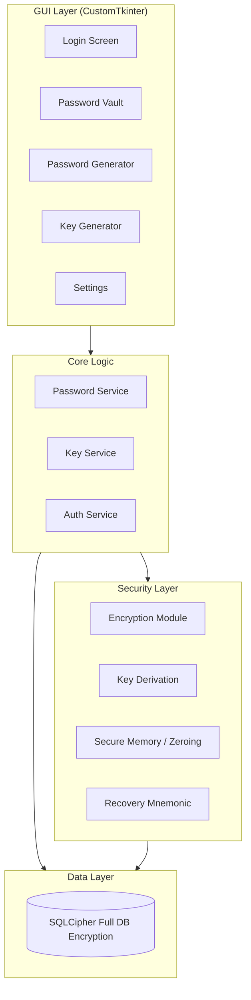
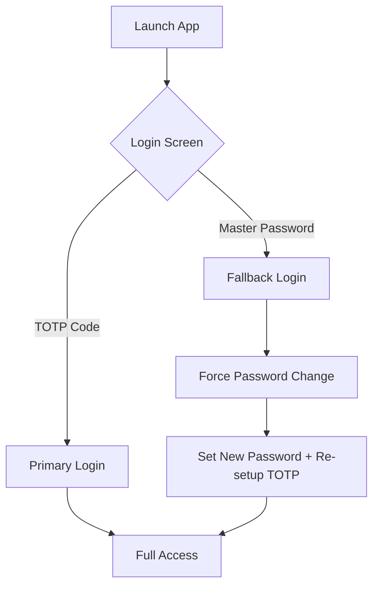

# Crypto Password Manager & Key Generator

A secure, feature-rich password manager and cryptographic key generator built with Python, featuring an encrypted SQLite database and a modern GUI interface.

## Architecture Overview



---

## Proposed Changes

### Project Structure

```
d:\pass\
├── main.py                 # Application entry point
├── requirements.txt        # Dependencies
├── config.py              # Configuration constants
│
├── core/
│   ├── __init__.py
│   ├── encryption.py      # AES-256-GCM (Authenticated Encryption)
│   ├── key_derivation.py  # Argon2id + Salt
│   ├── secure_memory.py   # bytearray zeroing utilities
│   └── mnemonic.py        # BIP-39 recovery phrase generation
│
├── database/
│   ├── __init__.py
│   ├── db_manager.py      # SQLCipher integration
│   └── models.py          # Data models
│
├── generators/
│   ├── __init__.py
│   ├── password_generator.py  # All password types
│   └── key_generator.py       # All cryptographic keys
│
├── gui/
│   ├── __init__.py
│   ├── app.py             # Main application window
│   ├── login_frame.py     # Master password login
│   ├── vault_frame.py     # Password vault view
│   ├── password_gen_frame.py  # Password generator UI
│   ├── key_gen_frame.py   # Key generator UI
│   ├── settings_frame.py  # Settings panel
│   └── components/
│       ├── __init__.py
│       ├── strength_meter.py  # Password strength indicator
│       └── entry_card.py      # Password entry display card
│
└── utils/
    ├── __init__.py
    ├── clipboard.py       # Clipboard operations with auto-clear
    └── validators.py      # Input validation
```

---

### Security Module

#### [NEW] [encryption.py](file:///d:/pass/core/encryption.py)
- **AES-GCM Authenticated Encryption** (superior to Fernet CBC+HMAC)
- Transparently handles IV/Nonce and Authentication Tag
- No additional HMAC layer needed as it's built-in

#### [NEW] [secure_memory.py](file:///d:/pass/core/secure_memory.py)
- Use `bytearray` for all sensitive key storage
- **Zero-out memory** using `memset`-style approach after use
- Prevent strings from being interned in Python's memory pool

#### [NEW] [mnemonic.py](file:///d:/pass/core/mnemonic.py)
- Generate 24-word recovery phrase (BIP-39)
- Derive Master Seed from mnemonic
- Ultimate recovery if TOTP/Password both fail

---

### Database Layer

#### [NEW] [db_manager.py](file:///d:/pass/database/db_manager.py)
- **SQLCipher 4** Integration: Full transparent database-level encryption
- Header MAC verification
- AES-256-GCM page encryption
- Database file is completely unreadable (random binary data) without the key
- Native secure delete (overwrites deleted data)

---

### Password Generation Module

#### [NEW] [password_generator.py](file:///d:/pass/generators/password_generator.py)

| Type | Description | Example |
|------|-------------|---------|
| **Standard** | Fully customizable character sets | `K#9mX$pL2@nQ` |
| **Passphrase** | Word-based (EFF wordlist) | `correct-horse-battery-staple` |
| **PIN** | Numeric only (4-12 digits) | `847291` |
| **Memorable** | Pronounceable combinations | `Brimlock42$` |
| **Pattern** | User-defined pattern | `Cvcc-9999-ccvc` |
| **Hex** | Hexadecimal string | `a3f7c2b1...` |

**Character Set Options (for Standard passwords):**

| Option | Characters | Toggle |
|--------|------------|--------|
| Uppercase | `A-Z` | ☑️ |
| Lowercase | `a-z` | ☑️ |
| Numbers | `0-9` | ☑️ |
| Symbols | `!@#$%^&*()_+-=[]{}` | ☑️ |
| Brackets | `()[]{}` | ☐ |
| Custom | User-defined set | ☐ |

**Additional Options:**
- **Length slider**: 8-128 characters
- **Minimum counts**: Require at least N uppercase, N numbers, etc.
- **Similar char randomization**: Randomly swap 1+ similar chars (0↔O, 1↔l↔I) for extra entropy
- **Start with letter**: For systems requiring letter-first passwords


---

### Key Generation Module

#### [NEW] [key_generator.py](file:///d:/pass/generators/key_generator.py)

> [!NOTE]
> Only cryptographically secure algorithms with strong defaults are included.

| Key Type | Library | Sizes/Options | Notes |
|----------|---------|---------------|-------|
| **RSA** | `cryptography` | 3072, 4096 bits only | 2048 removed (weak for long-term use) |
| **Ed25519** | `cryptography` | Fixed 256-bit | Modern, fast, highly secure |
| **AES** | `cryptography` | 256-bit only | GCM mode for authenticated encryption |
| **SSH Keys** | `cryptography` | Ed25519 (default), RSA-4096 | OpenSSH format export |
| **X.509 Cert** | `cryptography` | Self-signed with SHA-384/512 | RSA-4096 or Ed25519 backing |
| **HMAC** | `cryptography` | SHA-256, SHA-384, SHA-512 | For message authentication |
| **ChaCha20-Poly1305** | `cryptography` | 256-bit | Authenticated encryption alternative to AES |

**Removed (Insecure/Deprecated):**
- ~~ECDSA with NIST curves~~ (potential backdoor concerns, Ed25519 preferred)
- ~~RSA-2048~~ (insufficient for long-term security)
- ~~AES-128/192~~ (256-bit is standard for high security)

---

### GUI Application

#### [NEW] [app.py](file:///d:/pass/gui/app.py)
- **CustomTkinter** for modern, dark-themed UI
- **Tabbed interface** with 4 main tabs
- Session timeout (configurable, default 5 min)

#### Layout Design:

```
┌─────────────────────────────────────────────────────────────────┐
│  🔐 CryptoPass                               [Lock] [Settings]  │
├─────────────────────────────────────────────────────────────────┤
│  [ Vault ]  [ Generator ]  [ Keys ]  [ Stats ]                  │
├─────────────────────────────────────────────────────────────────┤
│                                                                 │
│  ┌─────────────────────┬───────────────────────────────────┐   │
│  │  PASSWORD LIST      │  DETAILS / GENERATOR PANEL        │   │
│  │  ───────────────    │  ─────────────────────────────    │   │
│  │  🔍 Search...       │                                   │   │
│  │                     │  (Shows details of selected item  │   │
│  │  📧 Gmail           │   OR generator controls based     │   │
│  │  🏦 Bank Account    │   on active tab)                  │   │
│  │  🐙 GitHub          │                                   │   │
│  │  💼 Work VPN        │                                   │   │
│  │                     │                                   │   │
│  │  [+ Add New]        │                                   │   │
│  └─────────────────────┴───────────────────────────────────┘   │
│                                                                 │
└─────────────────────────────────────────────────────────────────┘
```

#### Tab Breakdown:

| Tab | Left Panel | Right Panel |
|-----|------------|-------------|
| **Vault** | Password list with search | Selected entry details (view/edit/copy) |
| **Generator** | Quick generation options | Password preview, strength meter, save |
| **Keys** | Generated keys list | Key details, export options |
| **Stats** | Overview metrics | Charts: password age, strength distribution |

#### GUI Features:
1. **Login Screen**: Master password entry with strength indicator
2. **Vault Tab**: 
   - Left: Searchable password list with categories
   - Right: Entry details (title, username, password, URL, notes)
   - Copy to clipboard (auto-clear after 30s)
   - Show/hide password toggle
3. **Generator Tab**:
   - Left: Password type selector, quick presets
   - Right: Character options, length slider, preview, strength meter
4. **Keys Tab**:
   - Left: Saved keys list
   - Right: Key type selection, generate, export (PEM/OpenSSH)
5. **Stats Tab**:
   - Password age analysis (old passwords needing rotation)
   - Strength distribution chart
   - Duplicate/weak password warnings

---

## Security Measures

> [!IMPORTANT]
> **Critical Security Features**
> - Master password never stored in plaintext
> - All vault data encrypted with AES-256 via Fernet
> - Argon2id for password hashing (resistant to GPU attacks)
> - Clipboard auto-clears after configurable timeout
> - Session auto-locks after inactivity
> - Secure random number generation via `secrets` module

---

## Dependencies

```txt
customtkinter>=5.2.0
cryptography>=41.0.0
argon2-cffi>=23.1.0
pyperclip>=1.8.2
```

---

## Verification Plan

### Automated Testing

1. **Run the application**:
   ```powershell
   cd d:\pass
   python main.py
   ```

2. **Test password generation** (all types work correctly):
   - Generate each password type
   - Verify randomness and format

3. **Test key generation** (all key types):
   - Generate RSA, Ed25519, AES, SSH keys
   - Verify key format and exportability

### Manual Verification

1. **First-time setup**:
   - Launch app → Create master password
   - Verify database file created with encryption

2. **Password vault operations**:
   - Add new password entry
   - Edit existing entry
   - Delete entry
   - Search functionality
   - Copy to clipboard (verify auto-clear)

3. **Security testing**:
   - Close app → Reopen → Verify login required
   - Idle timeout → Verify auto-lock
   - Try wrong master password → Verify rejection

4. **Database encryption verification**:
   - Open database file in SQLite browser
   - Verify all sensitive fields are encrypted (unreadable)

---

## User Review Required

> [!IMPORTANT]
> **Changes made based on your feedback:**
> - ✅ Removed insecure key types: ECDSA (NIST curves), RSA-2048, AES-128/192
> - ✅ Added detailed password character set options with toggles
> - ✅ Keeping CustomTkinter for modern dark-themed GUI
>
> Please confirm the plan looks good to proceed with implementation.

---

## Enhancement: TOTP Authenticator Unlock

### Overview

Add TOTP (Time-based One-Time Password) as the **primary unlock method** with master password as emergency fallback.



### How It Works

1. **Setup Phase** (first-time or in Settings):
   - Generate TOTP secret (32-byte random)
   - Display QR code for Google/Microsoft Authenticator
   - User scans and confirms with a test code
   - Secret stored **encrypted**, backup key created

2. **Normal Daily Login (TOTP - Primary)**:
   - User enters 6-digit TOTP code from authenticator app
   - App verifies code, unlocks vault with stored backup key
   - **Full access** to all features

3. **Emergency Login (Master Password - Fallback)**:
   - User uses master password (verified against stored hash).
   - **Verification Prompt**: App asks "Did you lose your phone or just temporary access?"
   - **Case: Lost Phone**:
     - Forces immediate password change.
     - Automatically clears old TOTP secret.
     - User must re-setup TOTP before next login.
   - **Case: Temporary Loss**:
     - Allows access with existing password.
     - **Persistent Warning**: A notice remains visible in the header until password is changed.
     - Frequent reminders during session every time the vault is unlocked.
   - **Catastrophic Failure**: 24-Word Recovery Mnemonic (BIP-39) remains the ultimate fallback.

4. **Security Model**:

| Login Method | Use Case | Access Level | Post-Login |
|--------------|----------|--------------|------------|
| **TOTP Code** | Daily use | Full Access | Normal |
| Master Password | Lost Phone | Recovery Access | **Forced Reset + TOTP Clear** |
| Master Password | Temp Access | Limited Access | **Persistent Warning** |
| Recovery Phrase | Absolute Failure | Full Recovery | **Full App Reset** |

### Database Changes

```sql
ALTER TABLE master_config ADD COLUMN totp_secret TEXT;  -- Encrypted
ALTER TABLE master_config ADD COLUMN backup_key BLOB;   -- Encrypted with TOTP-derived key
ALTER TABLE master_config ADD COLUMN totp_enabled INTEGER DEFAULT 0;
```

### New Dependencies

```txt
pyotp>=2.9.0    # TOTP generation/verification
qrcode>=7.4.2   # QR code generation for authenticator setup
pillow>=10.0.0  # Image handling for QR display
```

### Security Considerations

> [!IMPORTANT]
> **Master Password is the recovery mechanism**, not primary authentication.
> - TOTP login (Primary) allows standard daily access.
> - Master Password login (Fallback) triggers recovery procedures (Reset or Warning).
> - TOTP secret is initially set up after the first Master Password creation.
> - Recovery Mnemonic should be stored offline (physical paper).

### Files to Modify

| File | Changes |
|------|---------|
| [db_manager.py](file:///d:/pass/database/db_manager.py) | Add TOTP columns, backup key storage |
| [login_frame.py](file:///d:/pass/gui/login_frame.py) | Add "Use Authenticator" button |
| [app.py](file:///d:/pass/gui/app.py) | Handle TOTP login flow, forced password change |
| [settings_frame.py](file:///d:/pass/gui/settings_frame.py) | TOTP setup with QR code |
| NEW: [totp_manager.py](file:///d:/pass/core/totp_manager.py) | TOTP generation/verification |
