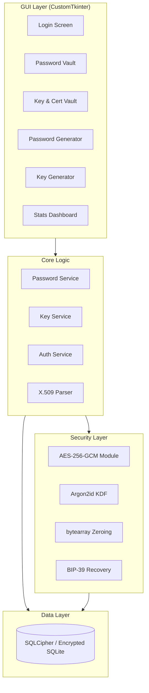

# Crypto Password Manager & Key Generator - Master Implementation Plan

This document is the single source of truth for the BitMarrow project architecture, completed milestones, and the future security roadmap.

## 🏛️ Architecture Overview

---

## ✅ Milestone 1: Core Foundation & Certificate Vault (Completed)

### 1. Stability & Infrastructure Fixes
- **Thread Recovery**: Replaced unsafe `threading.Timer` with `self.after` in `gui/app.py`, resolving `sqlite3.ProgrammingError` and `TclError`.
- **Database Resilience**: Enabled `check_same_thread=False` for SQLite and updated schema to support certificates.
- **UI Logic**: Standardized `StrengthMeter` and `CTkImage` rendering paths.
- **KeyGen Fix**: Resolved `AttributeError` in `KeyGenFrame` initialization.

### 2. Certificate Vault & Key Management
- **Detailed Parsing**: Implemented `KeyGenerator.parse_certificate()` to extract Subject, Issuer, and Expiry from PEM files.
- **Enhanced Storage**: Updated `crypto_keys` table to store encrypted metadata and expiration timestamps.
- **Import/Export**: Added GUI support for importing external `.pem` certificates into the vault.
- **Dedicated UI**: Launched the **📜 Key Vault** tab for specialized management of cryptographic secrets.

### 3. Private Key Privacy & UI Standardisation (Implemented)
- **Masking Toggles**: All private keys in the Generator preview and Vault detail view are now masked by default. Added "Show/Hide" toggles.
- **Labeling Standard**: Standardized public/private labeling to prevent confusion.
- **Copy Protection**: Verified that "Copy" retrieves raw data even when masked.
- **Dedicated UI**: Launched the **📜 Key Vault** tab for specialized management of cryptographic secrets.

---

## 🚀 Milestone 2: Advanced Security & MFA Roadmap

This phase transitions the app into a tiered, multi-factor security environment based on OWASP best practices.

### 1. 🔐 Tiered Authentication Model

We are moving to a dual-password system to balance security and usability.

#### **Master Password (MP) - "The Root Key"**
- **Purpose**: Required for setup, changing security settings, and emergency recovery.
- **Security**: Never stored. Derives the **Master Key Encryption Key (MKEK)** via Argon2id.

#### **Login Password (LP) + TOTP - "Daily Access"**
- **Purpose**: Convenient daily unlock. Requires both a valid password and a 6-digit TOTP code.
- **Security**: Derives a **Login KEK**. Access is granted if the combination of factors unseals the session-specific key.

### 2. 🛡️ Urgent Phase: Security Enforcement & TOTP Verification - v1.2.0 (Completed)

As per latest requirements, we have implemented a strict enforcement layer:

#### **Secure Password Checklist (Enforced)**
Before an MP or LP can be saved or changed, it must pass:
- **Minimum Length**: 12 characters.
- **Complexity**: Uppercase, lowercase, number, and special character.
- **Entropy Check**: Must score at least "Good" (50+) on the internal `StrengthMeter` (Excellent tier rewarded for 16+ chars).
- **Checklist UI**: Live visual feedback; "Save" is disabled until all criteria are met.

#### **Mandatory TOTP Verification & Resilient Sealing**
TOTP setup now follows a mandatory verification loop and uses **hex-encoding** for the master key wrapper to ensure cryptographic stability (Resilient unsealing fallback for v1.1.0 data).

---

## 🛠️ Implementation Backlog (Prioritized)

### Phase A: Security Refactor (High Priority)
- [x] **Password Validator**: Implemented `utils.validators.PasswordValidator`.
- [x] **Enforced Checklist UI**: Updated `LoginFrame` with live checklist.
- [x] **TOTP Verification Loop**: Forced code verification in setup dialog.
- [ ] **Dual Passwords**: Update `DatabaseManager` for Master vs Login hashes.
- [ ] **Full DB Encryption**: Transition to **SQLCipher** for total confidentiality.

### Phase B: Session & Protections (Medium)
- [ ] **Easy Login Timer**: Configurable session window (5 min to 24 hours).
- [ ] **Auto-Lock**: Implement triggers for system sleep and global inactivity.
- [ ] **Audit Logging**: Local, encrypted log of all vault modifications and login attempts.

## ✅ Milestone 3: Hardened Authentication & Secure Storage (v3.0.0 Completed)

### 1. Enforced Security
- **Mandatory Setup**: Users are now forced to set up a PIN and Everyday Password if they haven't already.
- **Login Check**: The `LoginFrame` logic now checks security status immediately after unlocking and redirects as needed.
- **Rekeying**: Master Password changes now trigger a full database re-encryption process.

### 2. Secure Blob Storage
- **Secondary DB**: Created `blobs.db` for encrypted file storage.
- **Attachment UI**: Integrated file upload/download within `NotesFrame`.
- **Linking**: Added `attachments` table to link notes with blob IDs.

### 3. Encrypted Backups
- **Migration Key Encryption**: Implemented `.cpback` format, encrypting the full vault bundle with the Migration Transfer Key.
- **Backup Manager**: Created `core.backup_manager.py` to handle zip/crypto operations.
- **Configurable Paths**: Added settings UI to define custom storage locations.
